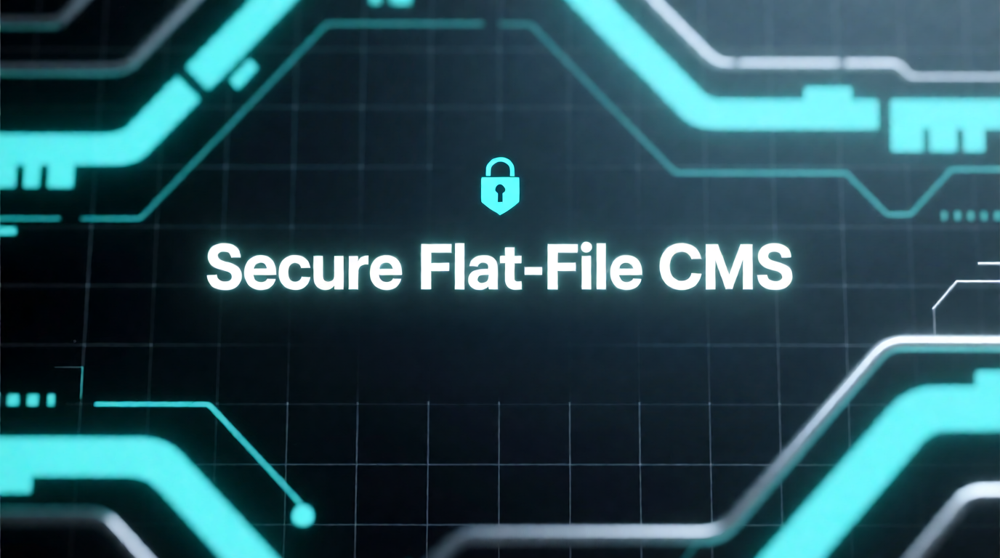

# Secure Flat-File CMS

A modern, lightweight, and **fully encrypted** Content Management System (CMS) built with PHP. It uses Markdown for content and JSON for configuration, storing all data securely encrypted at rest using **AES-256-GCM**.

**Author:** Eduardo Nacimiento-García  
**Email:** enacimie@ull.edu.es  
**License:** GPLv3

---

## 🚀 Key Features

*   **🔒 Military-Grade Encryption:** All content, config, and media are encrypted with **AES-256-GCM** (Authenticated Encryption). Even if the server is compromised, files remain unreadable and tamper-proof without the key.
*   **🛡️ Two-Factor Authentication (2FA):** Built-in support for TOTP (Google Authenticator, Authy, etc.) for admin login. Secrets are generated locally in the browser and stored encrypted.
*   **⚡ High Performance:**
    *   **Encrypted Index:** O(1) lookups using `index.json`.
    *   **Output Caching:** Public pages are cached as static HTML to bypass decryption on subsequent hits.
    *   **File Locking:** Atomic writes (ACID-compliant) to prevent data corruption.
*   **🔌 Headless API:** Consumable JSON API (`/api/content/{slug}`) to use the CMS as a backend for React, Vue, or Mobile apps.
*   **🎨 Professional Themes:** Includes 6 high-quality themes (`Default`, `Nexus`, `Zenith`, `Vanguard`, `Lumina`, `Essence`) covering Corporate, Editorial, Magazine, and Portfolio styles.
*   **🧩 Extensible:**
    *   **Plugin System:** Hook-based architecture.
    *   **Shortcode UI:** Built-in plugin for rich components (Alerts, Buttons, Pricing Tables, etc.).
    *   **Documentation Viewer:** View plugin details directly in the admin panel.
*   **📝 Hybrid Editor:** Write in **Markdown** or use the **Visual WYSIWYG Editor** (Toast UI).
*   **🏷️ Taxonomies:** Native support for `tags` and `category` in Markdown frontmatter.
*   **🕰️ Version Control:** Automatic history tracking for every file change with a visual **Restore** interface.
*   **🔍 SEO Ready:** Auto-generated `sitemap.xml`, Open Graph meta tags, and internal search.

## 🛠️ Requirements

*   **PHP 8.1** or higher.
*   `openssl` extension enabled.
*   `json` extension enabled.
*   Write permissions on the `storage/` directory.

## 📦 Installation

**No database setup required.**

1.  **Clone the repository:**
    ```bash
    git clone https://github.com/yourusername/secure-cms.git
    cd secure-cms
    ```

2.  **Install Dependencies:**
    ```bash
    composer install
    ```

3.  **Start the Server:**
    ```bash
    php -S localhost:8000 -t public public/router.php
    ```

4.  **Run the Wizard:**
    Open [http://localhost:8000](http://localhost:8000) in your browser.
    The system will detect the missing configuration and launch the **Secure Installation Wizard**.
    *   It will generate a cryptographic key (`key.php`).
    *   It will set up your Admin account.

## 📖 Usage Guide

### Dashboard
Access the admin panel at `/admin`.
*   **Create/Edit:** Use the "Visual Mode" for a Word-like experience or "Markdown Mode" for control.
*   **Media:** Drag images into the editor to upload them securely.
*   **History:** Click the "History" button in the editor to view and restore previous versions of a page.

### 🛡️ Setting up 2FA
1.  Go to **Settings** (or `/admin/extensions`).
2.  Scroll to "Security & Access".
3.  Click **Generate** to create a new Base32 Secret.
4.  Scan the QR code with your Authenticator App.
5.  Click **Save**.

### 🔌 API (Headless Mode)
You can fetch page content in JSON format for external applications:

**Request:**
`GET /api/content/my-page-slug`

**Response:**
```json
{
  "meta": {
    "title": "My Page",
    "date": "2025-12-30",
    "status": "published",
    "tags": ["tech", "php"],
    "category": "blog"
  },
  "content": "<h1>My Page</h1><p>...</p>",
  "generated_at": "2025-12-30T20:00:00+00:00"
}
```

### 🧩 Shortcodes
Enable the **Shortcode UI** plugin to use these components in your Markdown:

| Component | Shortcode |
| :--- | :--- |
| **Grid** | `[grid][col]Left[/col][col]Right[/col][/grid]` |
| **Alert** | `[alert type="info"]Message[/alert]` |
| **Button** | `[button url="/contact"]Click Me[/button]` |
| **Card** | `[card title="Title"]Content[/card]` |
| **YouTube** | `[youtube id="VIDEO_ID"]` |
| **Stats** | `[stat value="100%" label="Uptime"]` |

## 📂 Project Structure

*   `app/Core/`
    *   `Security.php` - AES-256-GCM encryption wrapper.
    *   `Store.php` - File I/O with **flock** locking mechanisms.
    *   `TwoFactor.php` - RFC 6238 TOTP implementation.
    *   `Indexer.php` - Manages metadata and taxonomies.
    *   `Controller.php` - Request handling, caching, and auth logic.
*   `public/` - Entry point (`index.php`) and Router (`router.php`).
*   `storage/` - **Encrypted Data Vault**.
    *   `content/` - Pages (Encrypted).
    *   `cache/` - Encrypted indexes & Public HTML cache (Cleartext for speed).
*   `themes/` - Front-end templates.

## 📄 License

This project is licensed under the **GNU General Public License v3.0 (GPLv3)**.

Copyleft 🄯 2025 Eduardo Nacimiento-García.
